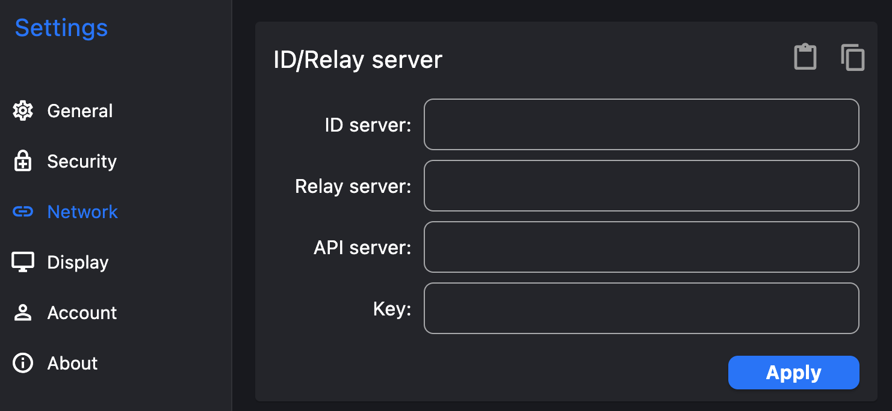

# rustdesk-api-server

RustDesk API Server Go version, supports sqlite3, mysql databases

After logging in, you can return all active hosts under the same account starting with this number

[](https://github.com/sctg-development/rustdesk-api-server/actions/workflows/build.yml)

## Compilation

Install Golang

Install GCC and configure PATH

## Usage

### Modify Database Connection

Modify the configuration items in conf/config.yml

```yaml
dbtype: mysql # supports mysql or sqlite3
mysql:
  host: '127.0.0.1'
  port: 3306 
  database: 'rustdesk' # database name
  username: 'root' # database username
  password: '' # database password
app:
  authkey: 123456 # authorization password for adding accounts or modifying passwords
  cryptkey: 123123123123  # password encryption salt value, recommended not to change after the first modification
```

### Set Up and Run

1. Run the program
   1. Running the program will automatically create tables

2. Port mapping (recommended):
   > Directly map port 21114 out, seems like rustdesk default port is 21114, at least for mobile it is ~~

   Nginx server:
   > Use reverse proxy, reverse proxy can use port 80 or whatever

   ```nginx
   #PROXY-START/

   location ^~ /
   {
       proxy_pass http://127.0.0.1:21114;
       proxy_set_header Host $host;
       proxy_set_header X-Real-IP $remote_addr;
       proxy_set_header X-Forwarded-For $proxy_add_x_forwarded_for;
       proxy_set_header REMOTE-HOST $remote_addr;
       proxy_set_header Upgrade $http_upgrade;
       proxy_set_header Connection $connection_upgrade;
       proxy_http_version 1.1;
       # proxy_hide_header Upgrade;

       add_header X-Cache $upstream_cache_status;

       #Set Nginx Cache

       set $static_file10BAHqk7 0;
       if ( $uri ~* "\.(gif|png|jpg|css|js|woff|woff2)$" )
       {
           set $static_file10BAHqk7 1;
           expires 1m;
       }
       if ( $static_file10BAHqk7 = 0 )
       {
           add_header Cache-Control no-cache;
       }
   }

   #PROXY-END/
   ```

### RustDesk Configuration

ID server and relay server can be found and installed using Docker

Here only the API server configuration is described


On Android, do not need to fill in the `http://` prefix and must be `21114` port

### Create Account

Request
<http://127.0.0.1:21114/api/reg?username=test&password=test&auth_key=123456>

UI
http://127.0.0.1:21114/

### Modify Password

Request
<http://127.0.0.1:21114/api/set-pwd?username=test&password=test&auth_key=123456>

## Note

When saving the address book, if `username` equals `----`, it will not be saved

## About

This project is for learning and is used for API server interaction with rustdesk remote assistance software

Using framework:
[beego](https://github.com/beego/beego)

Because RustDesk interface returns fixed content = =, the interface return structure is not very uniform

## Sponsorship
